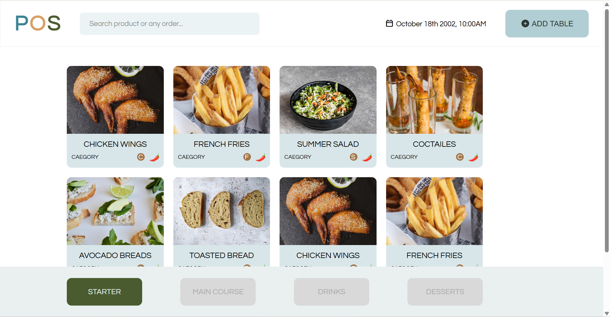

დავალება: CSS Fundamentals – დიზაინის იმპლემენტაცია
📌 აღწერა

თქვენი დავალებაა მოცემული დიზაინის აწყობა HTML და CSS ტექნოლოგიების გამოყენებით.
მთავარი მიზანია სუფთა, ვალიდური და ადვილად წაკითხვადი კოდის დაწერა, რომელიც ვიზუალურად მაქსიმალურად ზუსტად გაიმეორებს Figma-ში მოცემულ დიზაინს.

🔗 Figma ლინკი: [Css fundamentals](https://www.figma.com/design/itqAVhJDIn39O3pYHuftbz/POS-restaurant-UI-system--Community-?node-id=0-1&p=f&t=f4Rg2a8ONnbGR6Ax-0)

🛠 ტექნიკური მოთხოვნები (Technical Requirements)
1. Semantic HTML

გამოიყენეთ სემანტიკური HTML ტეგები, როგორიცაა:

<header>

<main>

<section>

<footer>

<button>

❗ მოერიდეთ 
-ების ზედმეტ და არასაჭირო გამოყენებას, როდესაც შესაძლებელია სემანტიკური ტეგის გამოყენება.

2. Selector Specificity

სტილიზაციისთვის გამოიყენეთ კლასები (class).

მოერიდეთ ელემენტის ტეგებით სტილიზაციას (მაგ: div p, section h1).

მოერიდეთ ID-ებით სტილიზაციას, რათა კოდი იყოს მარტივად წაკითხვადი და გასაფართოებელი.

3. Unique IDs

ყველა ID უნდა იყოს უნიკალური.

ერთ გვერდზე არ უნდა არსებობდეს ორი ერთნაირი ID.

4. Naming (დასახელება)

კლასებისა და ID-ების სახელები უნდა იყოს:

აღწერითი (descriptive)

ინგლისურ ენაზე

მაგ:
✅ card-title, main-navigation
❌ box1, test, div2

5. Selectors

გამოიყენეთ class-ები სტილიზაციისთვის.

ელემენტების ტეგებით (p, h1, div) სტილიზაცია არ არის რეკომენდებული.

სურვილის შემთხვევაში, შეგიძლიათ გამოიყენოთ ID-ები, თუმცა ეს სავალდებულო არ არის.

6. Pseudo-classes

სტილიზაციისთვის გამოიყენეთ ფსევდო-კლასები, მაგალითად:

:hover

:active

:focus

7. Pseudo-elements

გამოიყენეთ ფსევდო-ელემენტები, როგორიცაა:

::before

::after

::first-letter

::first-line

📄 დოკუმენტაცია (README Requirement)

სავალდებულოა, რომ README.md ფაილში ჩანდეს თქვენი ნამუშევრის ვიზუალური პრევიუ.

ინსტრუქცია:

გადაიღეთ აწყობილი გვერდის სქრინშოთი.

დაარქვით ფაილს სახელი: preview.png

ატვირთეთ ეს სურათი თქვენს GitHub რეპოზიტორიაში, კოდის ფაილებთან ერთად.

ჩასვით სურათი README.md ფაილში.

✅ მიღების კრიტერიუმები (Acceptance Criteria)

დავალება ჩაითვლება მიღებულად, თუ:

✔️ ვიზუალი შეესაბამება Figma-ს დიზაინს

✔️ HTML სტრუქტურა არის სემანტიკურად სწორი

✔️ CSS სტილიზაცია ხდება კლასების გამოყენებით

✔️ არ არსებობს დუბლირებული ID-ები

✔️ README.md ფაილში დამატებულია ნამუშევრის სქრინშოთი
